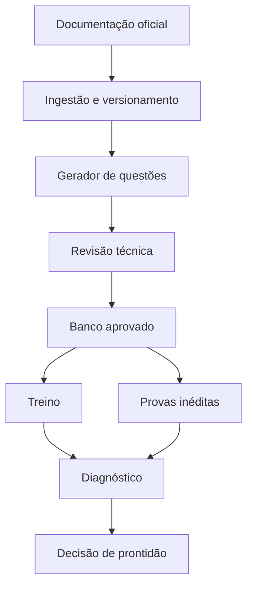

# SDD — Simulador de Prontidão AZ-104

## 1. Objetivo

Construir uma aplicação web local-first que gere, valide e aplique simulados originais para o exame Microsoft AZ-104. O sistema deve estimar prontidão sem depender de dumps, evitar inflação de nota por repetição e manter cada questão rastreável à documentação oficial vigente.

O produto não tenta reproduzir a pontuação escalonada da Microsoft. Ele mede percentual bruto, domínio técnico, dificuldade, estabilidade entre tentativas, dependência de consulta e capacidade de justificar respostas.

## 2. Resultado esperado

O usuário deve conseguir:

1. Sincronizar o blueprint e a documentação oficial da AZ-104.
2. Gerar questões originais com OpenAI ou Anthropic.
3. Validar cada questão por evidência e revisão cruzada.
4. Estudar em modo treino com feedback imediato.
5. Executar provas inéditas de 55 questões em 100 minutos.
6. Ver desempenho por domínio, subobjetivo, dificuldade e tipo de erro.
7. Receber uma decisão explícita: `não pronto`, `quase pronto` ou `pronto`.

## 3. Fora de escopo

- Coletar, armazenar ou reproduzir perguntas memorizadas da prova real.
- Prometer equivalência estatística com a nota oficial 700/1000.
- Automatizar inscrição ou execução da prova Microsoft.
- Usar conteúdo não verificável como fonte técnica.
- Transformar o sistema em curso completo de Azure.

## 4. Fonte de verdade

### 4.1 Fontes técnicas permitidas

Prioridade obrigatória:

1. Study Guide oficial AZ-104.
2. Microsoft Learn e documentação Azure vinculada ao blueprint.
3. Microsoft Exam Sandbox para formatos de interação.
4. Microsoft Practice Assessment para calibração externa.

Fontes extraoficiais podem orientar estilo, dificuldade e administração do tempo, mas nunca determinar a resposta técnica.

### 4.2 Blueprint inicial

Usar os pesos vigentes no Study Guide:

| Domínio | Peso |
|---|---:|
| Identidades e governança | 20–25% |
| Storage | 15–20% |
| Compute | 20–25% |
| Networking | 15–20% |
| Monitoramento e recuperação | 10–15% |

O blueprint não pode ficar hard-coded. Deve ser versionado por `effectiveDate`, permitindo recalcular cobertura e invalidar questões afetadas após uma atualização.

## 5. Princípios de produto

1. **Evidência antes de volume:** questão sem prova documental não entra no banco.
2. **Ineditismo mensurável:** itens de validação nunca aparecem no treino.
3. **Resposta mais correta:** os distratores devem ser plausíveis, mas apenas uma combinação pode satisfazer todas as restrições.
4. **Cobertura controlada:** geração segue domínio, subobjetivo, dificuldade e formato solicitados.
5. **Reprodutibilidade:** prompts, modelo, temperatura, fontes e versões ficam registrados.
6. **Atualização segura:** mudança documental coloca itens relacionados em revisão.
7. **Sem falsa precisão:** a aplicação não converte percentual em nota Microsoft.

## 6. Arquitetura proposta

### 6.1 Stack

- Next.js com TypeScript.
- SQLite para uso individual; Drizzle ORM para permitir migração futura a PostgreSQL.
- Tailwind CSS para interface.
- Zod para validação de contratos.
- Playwright para testes end-to-end.
- Vitest para testes unitários.
- Adaptadores independentes para OpenAI e Anthropic.
- Execução local com `npm run dev`; Docker opcional.

Não usar vector database no MVP. O corpus é pequeno e estruturado; busca textual, metadados e seleção explícita de trechos reduzem custo e tornam a evidência auditável. Adicionar embeddings somente se a recuperação lexical se mostrar insuficiente.

### 6.2 Componentes



## 7. Modelo de dados

### 7.1 Entidades principais

#### `blueprint_versions`

- `id`
- `exam_code`
- `effective_date`
- `source_url`
- `content_hash`
- `status`: `active | superseded`
- `created_at`

#### `objectives`

- `id`
- `blueprint_version_id`
- `domain`
- `domain_weight_min`
- `domain_weight_max`
- `section`
- `skill`
- `canonical_key`

#### `source_documents`

- `id`
- `url`
- `title`
- `retrieved_at`
- `content_hash`
- `official`
- `raw_markdown`
- `status`: `active | changed | unavailable`

#### `source_passages`

- `id`
- `source_document_id`
- `heading_path`
- `passage_text`
- `passage_hash`

#### `questions`

- `id`
- `objective_id`
- `stem`
- `scenario`
- `type`: `single | multiple | ordering | matching | hot_area | case_study`
- `difficulty`: `easy | medium | hard`
- `cognitive_level`: `recall | apply | analyze`
- `language`: `en-US | pt-BR`
- `pool`: `training | validation | retired`
- `status`: `draft | reviewing | approved | rejected | stale`
- `generator_provider`
- `generator_model`
- `prompt_version`
- `created_at`

#### `question_options`

- `id`
- `question_id`
- `label`
- `text`
- `is_correct`
- `explanation`
- `display_order`

#### `question_evidence`

- `question_id`
- `source_passage_id`
- `supports`: `stem | correct_answer | distractor`
- `rationale`

#### `question_reviews`

- `id`
- `question_id`
- `reviewer_provider`
- `reviewer_model`
- `technical_verdict`
- `ambiguity_verdict`
- `style_verdict`
- `severity`
- `findings_json`
- `created_at`

#### `exam_forms`

- `id`
- `kind`: `diagnostic | practice | readiness`
- `blueprint_version_id`
- `question_count`
- `duration_seconds`
- `created_at`
- `started_at`
- `completed_at`

#### `attempt_answers`

- `exam_form_id`
- `question_id`
- `selected_option_ids`
- `confidence`: `low | medium | high`
- `reasoning_summary`
- `consulted_documentation`
- `time_spent_seconds`
- `is_correct`

#### `readiness_snapshots`

- `id`
- `created_at`
- `classification`
- `overall_score`
- `hard_score`
- `domain_scores_json`
- `reasoning_score`
- `lookup_rate`
- `evidence_json`

## 8. Pipeline documental

### 8.1 Ingestão

1. Buscar o Study Guide oficial.
2. Extrair domínios, pesos, seções e skills.
3. Buscar apenas páginas oficiais relacionadas aos objetivos.
4. Converter conteúdo principal em Markdown limpo.
5. Dividir por títulos, preservando contexto suficiente.
6. Calcular hash por documento e passagem.
7. Registrar data de recuperação.

### 8.2 Detecção de mudança

Ao sincronizar novamente:

- Documento sem mudança: nenhuma ação.
- Passagem alterada: marcar como `stale` todas as questões dependentes.
- Blueprint alterado: criar nova versão; nunca sobrescrever a anterior.
- Objetivo removido: retirar suas questões de futuras provas.

Não atualizar automaticamente respostas existentes. Toda mudança exige nova validação.

## 9. Geração de questões

### 9.1 Contrato de geração

O gerador recebe:

- Um objetivo específico.
- Passagens oficiais selecionadas.
- Tipo de questão.
- Dificuldade.
- Nível cognitivo.
- Idioma.
- Restrições estilísticas.

Retorna JSON estrito validado por Zod.

### 9.2 Molde semântico

Questões `apply` e `analyze` devem conter:

1. Ambiente atual.
2. Recursos nomeados.
3. Mudança ou necessidade.
4. Pelo menos uma restrição decisiva.
5. Pergunta operacional.
6. Alternativas plausíveis.

Restrições comuns:

- privilégio mínimo;
- menor esforço administrativo;
- menor downtime;
- menor custo;
- tráfego privado;
- compatibilidade regional;
- escopo correto;
- ordem obrigatória;
- SKU compatível.

### 9.3 Distribuição de dificuldade

- Fácil: 20%.
- Média: 50%.
- Difícil: 30%.

No máximo 20% das questões podem ser `recall`. O restante deve exigir aplicação ou análise.

### 9.4 Regras de alternativas

- Comprimento semelhante.
- Gramática paralela.
- Sem respostas caricatas.
- Sem pistas como absolutismos desnecessários.
- Distratores devem representar erros reais: escopo, serviço semelhante, ordem, SKU, permissão excessiva ou requisito parcialmente atendido.
- Questão de resposta única não pode ter duas soluções defensáveis.
- Questão múltipla deve informar exatamente quantas opções selecionar.

## 10. Validação automática

### 10.1 Etapas

1. **Validação estrutural:** schema, quantidade de opções, cardinalidade e campos obrigatórios.
2. **Validação de evidência:** cada afirmação decisiva deve apontar para uma passagem oficial.
3. **Revisão independente:** outro provedor avalia a questão sem receber o raciocínio do gerador.
4. **Julgamento final:** um terceiro passe decide aprovação, revisão manual ou rejeição.
5. **Checagem de similaridade:** impedir duplicatas e paráfrases próximas entre treino e validação.

### 10.2 Critérios de rejeição

Rejeitar se ocorrer qualquer um:

- Evidência insuficiente.
- Mais de uma resposta justificável.
- Informação fora do objetivo.
- Dependência de recurso Preview sem necessidade.
- Distrator factualmente falso de forma trivial.
- Resposta denunciada pelo tamanho ou vocabulário.
- Tradução que altera o significado técnico.
- Dependência de comportamento desatualizado.
- Similaridade alta com outra questão.

### 10.3 Similaridade

Usar duas verificações:

- Similaridade lexical por tokens normalizados.
- Similaridade semântica por embeddings, caso habilitados.

Bloquear inclusão no pool de validação quando houver sobreposição substancial de cenário, decisão técnica e resposta com qualquer questão já apresentada ao usuário.

## 11. Pools e prevenção de contaminação

### 11.1 Pools

- `training`: pode aparecer repetidamente e mostra explicação.
- `validation`: reservado para provas de prontidão; nunca aparece em treino.
- `retired`: inválido, desatualizado ou já consumido.

### 11.2 Regras

- Questão de validação apresentada uma vez fica consumida para fins de prontidão.
- Refazer a mesma prova não conta para a decisão.
- Variações superficiais da mesma questão compartilham `concept_family_id` e contam como uma única exposição.
- A aplicação não mostra explicações das três provas finais até a última ser concluída.

Meta mínima antes de liberar readiness mode:

- 250 questões aprovadas no treino.
- 180 questões aprovadas e inéditas na validação.
- Cobertura de 100% dos subobjetivos oficiais.

## 12. Modos de uso

### 12.1 Diagnóstico

- 30 questões.
- Cobertura ampla.
- Sem impacto na prontidão.
- Produz mapa inicial de lacunas.

### 12.2 Treino

- Filtro por domínio, skill, dificuldade e formato.
- Feedback imediato.
- Explicação de todas as alternativas.
- Link para a documentação.
- Repetição espaçada de erros.

### 12.3 Prova prática

- 55 questões.
- 100 minutos.
- Distribuição conforme blueprint.
- Sem feedback durante a sessão.
- Pode usar questões já vistas; não conta como prontidão.

### 12.4 Readiness mode

- Três formulários independentes.
- 55 questões inéditas por formulário.
- 100 minutos cada.
- Pelo menos um case study por formulário.
- Sem pausa e sem feedback intermediário.
- Ordem das alternativas randomizada quando semanticamente seguro.
- Registro de confiança, consulta e tempo por questão.

## 13. Composição de uma prova

O montador deve resolver uma matriz de restrições:

- Pesos do blueprint.
- 20/50/30 por dificuldade.
- Máximo de 20% recall.
- Mínimo de 15% envolvendo CLI, PowerShell, ARM, Bicep ou configuração concreta.
- Pelo menos um estudo de caso com 4–6 itens.
- Sem repetição de `concept_family_id` na mesma prova.
- Nenhuma questão previamente exposta no readiness mode.

Se o banco não atender a matriz, a prova não deve ser criada. Mostrar exatamente quais cotas estão faltando.

## 14. Captura de raciocínio

Antes de revelar alternativas, o sistema pode pedir uma frase curta:

> Qual requisito decide esta resposta?

Depois da seleção, registrar confiança e eventual consulta à documentação.

O avaliador de raciocínio compara a frase com uma rubrica composta por conceitos necessários, não com uma resposta textual exata. A nota de raciocínio não altera o acerto da questão; ela altera a confiança da estimativa de prontidão.

## 15. Pontuação e prontidão

### 15.1 Métricas

- Percentual bruto geral.
- Percentual por domínio.
- Percentual por dificuldade.
- Percentual por nível cognitivo.
- Percentual com confiança alta.
- Taxa de acerto confiante incorreto.
- Taxa de consulta.
- Tempo mediano por tipo.
- Nota de justificativa.

### 15.2 Regra de classificação

#### `pronto`

Todos os requisitos:

- Três readiness exams concluídos.
- Média geral ≥ 85%.
- Nenhum exame < 82%.
- Nenhum domínio agregado < 75%.
- Questões difíceis ≥ 80%.
- Justificativas corretas em ≥ 80% dos acertos avaliados.
- Taxa de consulta ≤ 15%.
- Pelo menos duas provas finalizadas com 15 minutos restantes.
- Microsoft Practice Assessment externo ≥ 85% na primeira tentativa final, informado manualmente pelo usuário.

#### `quase pronto`

- Média geral ≥ 78%.
- Nenhum domínio < 65%.
- Não atende a no máximo dois critérios de `pronto`.

#### `não pronto`

Qualquer outro caso.

Esses limiares são heurísticos e configuráveis. A UI deve declará-los como estimativa interna, não política Microsoft.

## 16. Laboratórios práticos

Adicionar checklist independente da prova. Cada laboratório tem objetivo, estado inicial, tarefas, evidência esperada e limpeza.

Cobertura mínima:

- Criar usuário, grupo e atribuição RBAC no escopo correto.
- Aplicar Policy, tags e resource lock.
- Configurar storage, redundância, SAS, firewall e lifecycle.
- Criar VM, disco, availability option e VM scale set.
- Criar App Service, deployment slot, TLS e scaling.
- Criar ACR e executar workload em container.
- Criar VNet, subnet, NSG, peering, route e private endpoint.
- Configurar Azure Monitor, alert, logs e consulta KQL básica.
- Configurar backup, restore e Site Recovery em cenário guiado.
- Interpretar ou modificar ARM/Bicep.

O MVP usa confirmação manual com checklist. Automação via Azure SDK fica para fase posterior.

## 17. Interface

### 17.1 Páginas

- `/dashboard`: prontidão, tendência e lacunas.
- `/study`: seleção de treino.
- `/exam`: execução cronometrada.
- `/review`: revisão de erros e evidências.
- `/questions`: administração do banco.
- `/sources`: documentos, versões e mudanças.
- `/generation`: filas, custo e falhas.
- `/settings`: provedores, modelos, idioma e limiares.

### 17.2 Tela de prova

- Timer persistente.
- Navegação e marcação para revisão.
- Indicador de questão e seção.
- Tabela lateral apenas quando o item exigir.
- Sem feedback antes da entrega.
- Estado salvo após cada resposta.
- Restauração segura após refresh, mantendo o relógio original.

Usar o Microsoft Exam Sandbox como referência funcional, sem copiar aparência proprietária.

## 18. Integrações de IA

Criar interface comum:

```ts
interface LlmProvider {
  generateQuestion(input: GenerationInput): Promise<QuestionDraft>;
  reviewQuestion(input: ReviewInput): Promise<QuestionReview>;
  gradeReasoning(input: ReasoningInput): Promise<ReasoningGrade>;
}
```

Configuração por variável de ambiente:

- `OPENAI_API_KEY`
- `ANTHROPIC_API_KEY`
- `GENERATOR_PROVIDER`
- `REVIEWER_PROVIDER`
- `GENERATOR_MODEL`
- `REVIEWER_MODEL`

Nunca enviar chaves ao cliente. Registrar tokens, latência e custo estimado por operação. Permitir orçamento máximo diário e interrupção automática.

O sistema deve funcionar com apenas um provedor, mas marcar a revisão como menos confiável quando geração e revisão usam o mesmo modelo.

## 19. Segurança e integridade

- Chaves apenas no servidor e fora do repositório.
- Sanitizar HTML da documentação.
- Proteger importações contra prompt injection presente em páginas externas.
- O prompt de sistema deve tratar a documentação como dados, nunca como instruções.
- Registrar origem de todo conteúdo.
- Proibir importação de sites declarados como dumps.
- Não expor chain-of-thought; armazenar apenas justificativas curtas e rubricas.

## 20. Observabilidade

Registrar:

- Falhas por estágio.
- Taxa de aprovação de questões geradas.
- Custo por questão aprovada.
- Discordância entre revisores.
- Cobertura por objetivo.
- Itens frequentemente contestados.
- Itens com desempenho anormalmente alto ou baixo.

Itens com acerto >95% ou <20% após exposição suficiente devem ir para revisão. Isso pode indicar trivialidade, ambiguidade ou erro técnico.

## 21. Testes

### 21.1 Unitários

- Cálculo de pesos e cotas.
- Classificação de prontidão.
- Consumo de questões inéditas.
- Detecção de mudança documental.
- Validação de schemas.
- Randomização sem alterar cardinalidade.

### 21.2 Integração

- Ingestão → geração → revisão → aprovação.
- Criação de prova respeitando a matriz.
- Persistência e retomada do timer.
- Marcação de questões como stale após mudança de fonte.
- Fallback entre provedores.

### 21.3 End-to-end

- Executar diagnóstico completo.
- Treinar e revisar resposta.
- Executar prova cronometrada.
- Completar três readiness exams e gerar classificação.
- Falhar claramente quando o banco não tiver cobertura suficiente.

## 22. Critérios de aceite do MVP

O MVP estará pronto quando:

1. Importar e versionar o blueprint vigente.
2. Ingerir páginas oficiais e detectar mudanças por hash.
3. Gerar questões em JSON válido usando um provedor.
4. Revisar questões usando segundo provedor ou segundo passe independente.
5. Exigir evidência oficial antes de aprovar.
6. Manter pools de treino e validação isolados.
7. Montar prova de 55 questões conforme pesos e dificuldade.
8. Executar timer, autosave, revisão e entrega.
9. Mostrar métricas por domínio e dificuldade.
10. Aplicar a regra de prontidão sem simular score Microsoft.
11. Passar nos testes críticos de ineditismo e composição.

## 23. Ordem de implementação

### Fase 1 — Fundação

- Next.js, banco, migrations e autenticação local simples.
- Entidades de blueprint, fontes, questões e tentativas.
- Importação manual do blueprint inicial.

### Fase 2 — Corpus e geração

- Ingestão oficial.
- Seleção de passagens.
- Adaptadores OpenAI/Anthropic.
- Geração estruturada.
- Tela administrativa de revisão.

### Fase 3 — Motor de prova

- Pools.
- Matriz de composição.
- Tela cronometrada.
- Autosave e resultados.

### Fase 4 — Prontidão

- Três formulários inéditos.
- Captura de confiança, consulta e justificativa.
- Dashboard e classificação.

### Fase 5 — Qualidade

- Similaridade semântica.
- Detecção automática de mudanças.
- Laboratórios.
- Análise psicométrica básica dos itens.

## 24. Decisões que não devem ser alteradas sem justificativa

- Separação física e lógica entre treino e validação.
- Evidência oficial obrigatória.
- Questão consumida não volta a contar para prontidão.
- Score interno não é apresentado como score Microsoft.
- Blueprint e fontes são versionados.
- Relato de candidato não é fonte técnica.
- Pergunta real memorizada ou dump não entra no corpus.

## 25. Referências iniciais

- Study Guide AZ-104: https://learn.microsoft.com/en-us/credentials/certifications/resources/study-guides/az-104
- Certificação AZ-104: https://learn.microsoft.com/en-us/credentials/certifications/azure-administrator/
- Practice Assessments: https://learn.microsoft.com/en-us/credentials/certifications/practice-assessments-for-microsoft-certifications
- Formato e duração: https://learn.microsoft.com/en-us/credentials/support/exam-duration-exam-experience
- Pontuação: https://learn.microsoft.com/en-us/credentials/certifications/exam-scoring-reports
- Segurança de exames: https://learn.microsoft.com/en-us/credentials/support/exam-and-assessment-lab-security-policies

